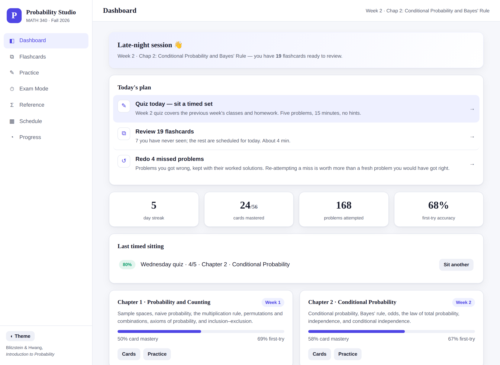
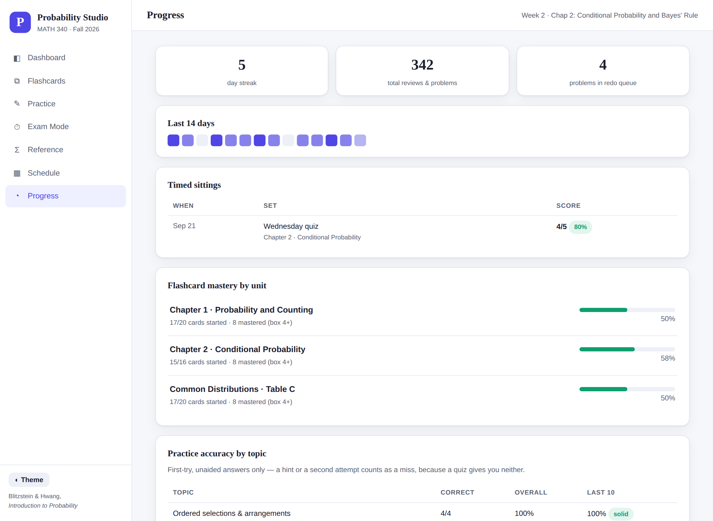
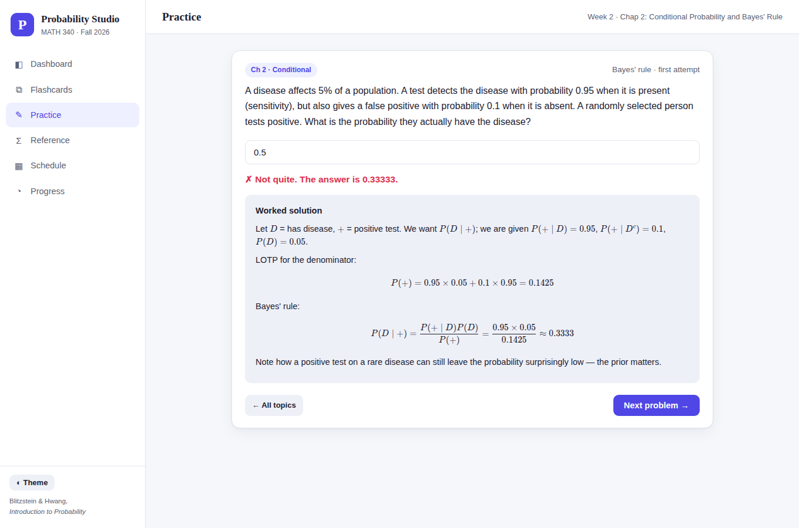
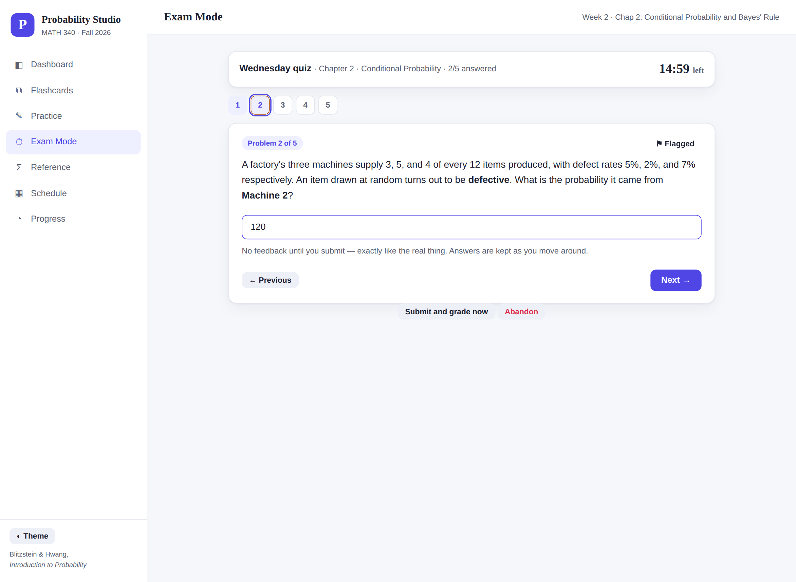
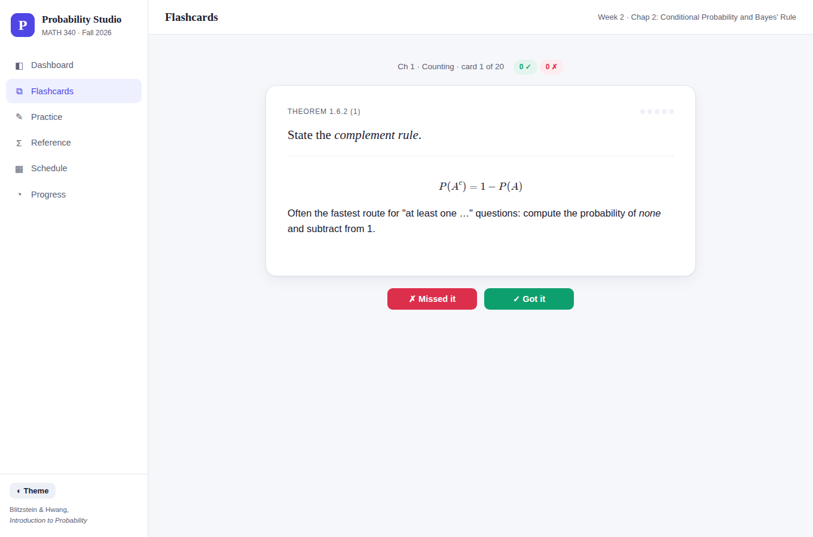
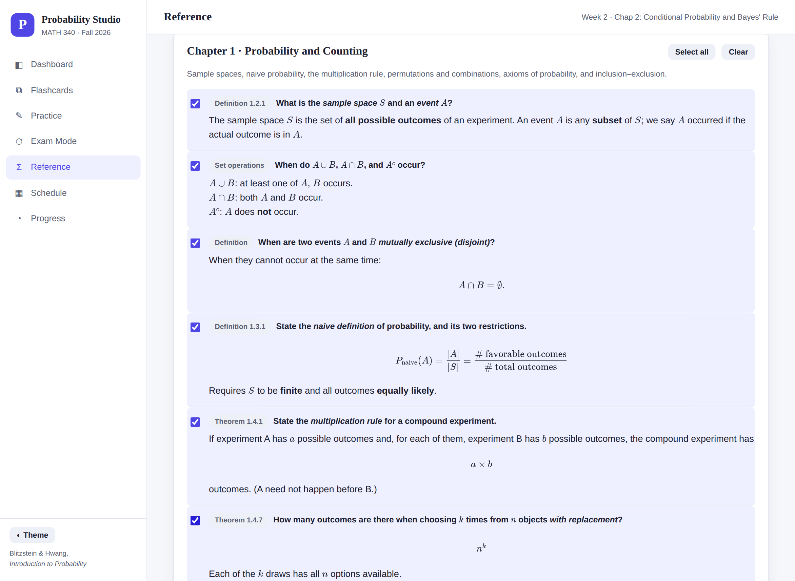

# Probability Studio — MATH 340 Study Companion

An interactive study tool for **MATH 340: Probability** (Fall 2026, Lawrence University), built as a fast, dependency-light static site. It turns each week's lecture material into **spaced-repetition flashcards**, **freshly generated practice problems with worked solutions**, **timed exam rehearsals**, and a **progress dashboard that tells you what to study next** — so the identities stick and the problem-solving methods become automatic before each Wednesday quiz, the midterm, and the final.

> **Textbook:** Blitzstein & Hwang, *Introduction to Probability* (2nd ed.) · **Course schedule, key dates, and grade weights are built in** from the syllabus.



## Features

**🃏 Flashcards with spaced repetition**
Every definition, theorem, and identity from lecture is a card (Definition 2.2.1, Bayes' rule, inclusion–exclusion, Table C distributions, …). A six-box Leitner system schedules reviews: cards you know move up a box and appear less often — the top box waits three weeks, long enough to carry a week-2 card to the cumulative final — and cards you miss drop to box 1 *and come back later in the same session*, so a lapse is relearned while you are still sitting there. Cards in box 4+ count as *mastered*. A **cram** mode ignores the schedule and leads with your weakest cards, which is what you actually want the night before a quiz. Keyboard-friendly (Space to flip, 1/2 to grade).

**✏️ Generated practice problems**
Each topic is a *family of problems*, not a fixed bank and not one template with the numbers shuffled. The 25 topics — permutations and arrangements, committees, sampling, naive probability, inclusion–exclusion, the complement trick, random splits, the probability axioms, two-way tables, the law of total probability, Bayes' rule, the chain rule, independence and reliability, odds, random variables and PMFs, CDFs, the Binomial, the Hypergeometric, the Discrete Uniform, functions of a random variable, and independence of random variables — hold **161 structurally different problem types** between them, and a topic cycles through all of its types before any one repeats.

That means a single topic will ask you to count directly, then via the complement, then adjust for overcounting, then reach for stars-and-bars; or run a rule forwards (law of total probability) and then backwards (Bayes), then solve it for a different unknown. Several variants exist purely to punish autopilot — disjoint events that are *not* independent, an event nested inside another, a two-headed coin. Answers accept decimals, fractions (`5/36`), or percents, and sensible rounding is credited.

The point is **recognising which method applies**, so the session is built around that:

- **The topic is hidden** in a mixed session until you answer. (Being told "complement trick" above a problem whose whole difficulty is spotting that you need the complement gives away the question.)
- **A wrong answer buys a hint and a second attempt**, not the answer — the worked solution is revealed one step at a time, and the first step points at the *method* rather than the arithmetic.
- **Common mistakes are named, not just marked wrong.** Answer the complement and it says so; hand back odds where a probability was asked for and it says that too.
- **Only unaided first attempts count as correct** in your stats, because that is the number that predicts how a quiz will go.
- **"Target my weak spots"** samples topics weighted by how badly you are doing at them, and untried topics rank high — you cannot know you are fine at something you have never attempted.
- **"Which method?" drill** shows a problem stem and four techniques, and asks only which one it wants. No arithmetic. It is the fastest way to train the skill that decides most exam questions.
- **Everything you miss is kept**, question and worked solution, in a redo queue you can re-attempt later. Getting the same problem right the second time is where most of the learning happens.

**⏱ Exam mode**
Timed, mixed, deferred-feedback problem sets — the conditions 70% of the grade is actually decided under. Presets match the syllabus: a 5-problem/15-minute Wednesday quiz on the most recent chapter, a 12-problem/70-minute midterm rehearsal (the real sitting is 1:50–3:00 pm), a 18-problem/150-minute cumulative final rehearsal, or a custom set. No hints, no topic labels, no feedback until you submit; free navigation, flag-for-review, and a question palette, like a paper exam. Afterwards you get a score, a per-topic breakdown of where the marks went, every worked solution, and every miss pushed into your practice stats and redo queue.

**📊 Progress tracking**
Per-chapter mastery bars, per-topic first-try accuracy (overall and last 10), **per-problem-shape accuracy** so you can see that a topic's respectable average is hiding one shape that keeps catching you, a timed-sitting history, a daily activity heatmap, and a study streak. Progress is stored in your browser and can be exported/imported as JSON to move between devices.



**🎯 A dashboard that answers "what should I do right now?"**
Not a wall of numbers — a ranked list of two or three concrete actions with a reason attached, built from what is due, what you have missed, what you are weakest at, and how close the next quiz or exam is.

**Σ Reference sheets and a formula-sheet builder**
Every identity from lecture on one searchable page, plus the full **Common Distributions table (Table C)** — story, support, PMF/PDF, mean, variance, and MGF for each named distribution. The midterm allows one 8.5×11" sheet, so the page doubles as the builder: tick the identities you want and hit print, and the print stylesheet drops everything else and sets your selection in two dense columns. The selection is saved and travels in your export.

**🧭 "Choosing the right tool" guides**
Formulas are the easy half. Each chapter carries a decision table — *when the question says …, reach for …, because …* — covering the wording cues that tell you it is a combination rather than a permutation, LOTP rather than Bayes, or a base rate you are about to ignore.

**🗓 Course schedule awareness**
The tool knows the 10-week schedule, highlights the current week, counts down to homework deadlines, the midterm (Oct 21), and the final (Nov 23), and flags quiz weeks.

| Practice — a miss buys a hint and another go | Exam mode — timed, no feedback until you submit |
| --- | --- |
|  |  |
| **Flashcards** — Leitner boxes, in-session relearning | **Reference** — tick identities, print the sheet |
|  |  |

## Using the site

The tool is a static site — no build step, no server, no account.

- **On GitHub Pages (recommended):** enable Pages for this repository (**Settings → Pages → Deploy from a branch → `main` / root**). The site will be live at `https://<username>.github.io/<repository-name>/`.
- **Locally:** clone the repo and open `index.html` in a browser, or serve it with `python3 -m http.server`.

Math rendering (KaTeX) is vendored in `lib/katex/`, so the site also works offline.

There is no build step and no test framework; both test suites are plain Node with no dependencies, and CI runs them on every push:

```sh
node tools/check-generators.js   # every problem variant is well posed
node tools/check-app.js          # grading, scheduling, weakness model, schema migration
```

## A study routine that fits the course

| When | What |
| --- | --- |
| Daily (5–10 min) | Work the Dashboard's "today's plan" — usually due flashcards plus your redo queue. |
| After each lecture | Study the new chapter's deck until every card is at box 2+. |
| Tuesday nights | **Cram** last week's deck, then sit a 5-problem timed quiz in Exam Mode — quizzes are Wednesdays and cover the previous week. |
| Whenever you have 10 minutes | "Target my weak spots", or the "which method?" drill if you are away from paper. |
| Two weeks before the midterm/final | Sit a full-length rehearsal, drill whatever it finds, repeat. Build and print the formula sheet from the Reference page. |

## Course content grows week by week

Lecture materials are released week-of, so the repository adds a content module per chapter as the term progresses:

| Unit | Status |
| --- | --- |
| Chapter 1 · Probability and Counting | ✅ Available |
| Chapter 2 · Conditional Probability | ✅ Available |
| Chapter 3 · Random variables, PMFs, CDFs, Bernoulli/Binomial, Hypergeometric, Discrete Uniform, functions of an r.v., independence & indicators | ✅ Available |
| Common Distributions · Table C | ✅ Available (reference + flashcards) |
| Chapters 4–8 (expectation and variance, Geometric/Poisson, continuous distributions, MGFs, multivariate, limit laws) | 🔜 Added as covered in class |

Each unit is a single self-registering file in `data/` — adding a new week requires **no changes to the application code**. See [`docs/ADDING_CONTENT.md`](docs/ADDING_CONTENT.md) for the 10-minute recipe (drop the new lecture PDF on Claude and ask it to follow that guide).

## Project structure

```
├── index.html            # App shell — add one <script> tag per new content unit
├── css/styles.css        # Theme (light/dark), layout, components
├── js/
│   ├── app.js            # Router, dashboard + study plan, schedule, reference, progress
│   ├── flashcards.js     # Leitner engine, review/cram sessions, in-session relearning
│   ├── practice.js       # Problem runner, hints, answer grading, "which method?" drill
│   ├── exam.js           # Timed deferred-feedback sittings + scored report
│   └── store.js          # localStorage persistence, weakness model, mistake log, export/import
├── data/
│   ├── manifest.js       # Course info, schedule, key dates, unit registry, math utils
│   ├── ch1.js            # Chapter 1 — flashcards + problem generators
│   ├── ch2.js            # Chapter 2 — flashcards + problem generators
│   ├── ch3.js            # Chapter 3 — random variables, PMF/CDF, named discrete distributions
│   └── distributions.js  # Table C reference + distribution flashcards
├── lib/katex/            # Vendored KaTeX (offline math rendering)
├── tools/
│   ├── check-generators.js  # Smoke test: every problem variant is well posed (node, no deps)
│   └── check-app.js         # Tests: answer grading, Leitner ladder, weakness model, migration
└── docs/ADDING_CONTENT.md
```

## Privacy

All progress data stays in your browser's `localStorage`. Nothing is transmitted anywhere.

## Acknowledgements

Content is transcribed and adapted from the MATH 340 lecture notes (S. Zhou) and Blitzstein & Hwang, *Introduction to Probability* (2nd ed.), whose Table C the distributions reference follows. This is a personal study aid, not an official course resource.
